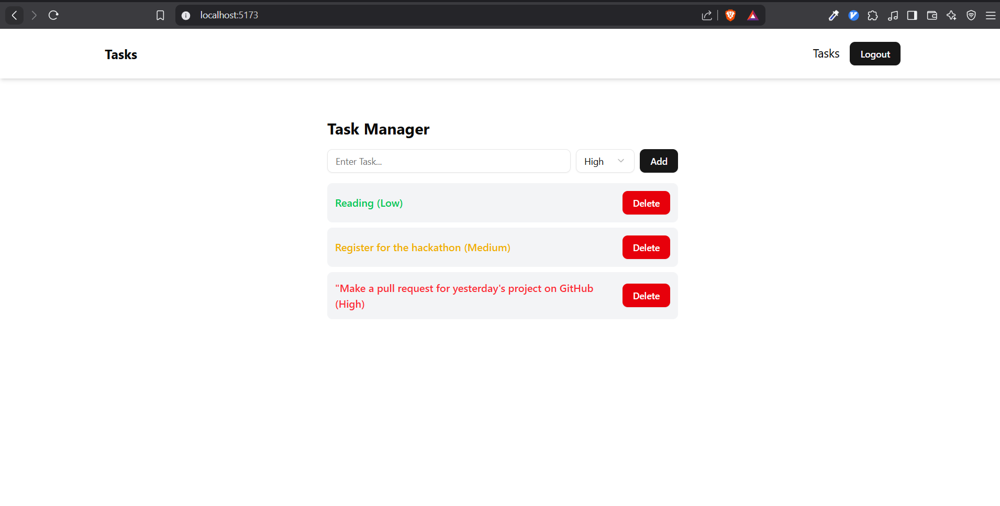

# Advanced React To-Do Application

## Overview

This is an advanced To-Do application built using React, Vite, and Tailwind CSS. The app enhances a basic to-do list by integrating an external API, implementing advanced state management with Redux, and ensuring responsiveness across different devices. The application features user authentication, task prioritization, and persistent storage.



## Features

- **Task Management**: Add, view, delete, and prioritize tasks (High, Medium, Low).
- **API Integration**: Fetch weather data to display relevant information for outdoor tasks.
- **State Management**: Utilizes Redux Toolkit and Redux Thunk for asynchronous actions.
- **Responsive Design**: Designed for mobile, tablet, and desktop using CSS Grid and Flexbox.
- **User Authentication**: Mock authentication with login/logout functionality using Redux.
- **Persistent Storage**: Uses LocalStorage or SessionStorage to retain data across sessions.

## Tech Stack

- **Frontend**: React 19, Vite, TypeScript, Tailwind CSS
- **State Management**: Redux Toolkit, Redux Thunk
- **UI Libraries**: Radix UI, Lucide React, clsx
- **API Handling**: Axios
- **Linting & Formatting**: ESLint, TypeScript

## Setup & Installation

1. **Clone the repository:**
   ```bash
   git clone https://github.com/adarshdotdev/advance-todo-app-assignment
   cd advanced-react-todo
   ```
2. **Install dependencies:**
   ```bash
   npm install
   ```
3. **Start the development server:**
   ```bash
   npm run dev
   ```
4. **Build for production:**
   ```bash
   npm run build
   ```
5. **Run the production build:**
   ```bash
   npm run preview
   ```
